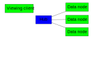

# sisock
Engine for Simons Observatory data serving through websockets.

## Requirements
* python3, crossbar.io, spt3g

## Key Files
* .crossbar/config.json &mdash; the configuration for the crossbar.io router (see the README in .crossbar for information on TLS certificates).
* sisock.py &mdash; the data server
* js/example.html &mdash; a simple client
