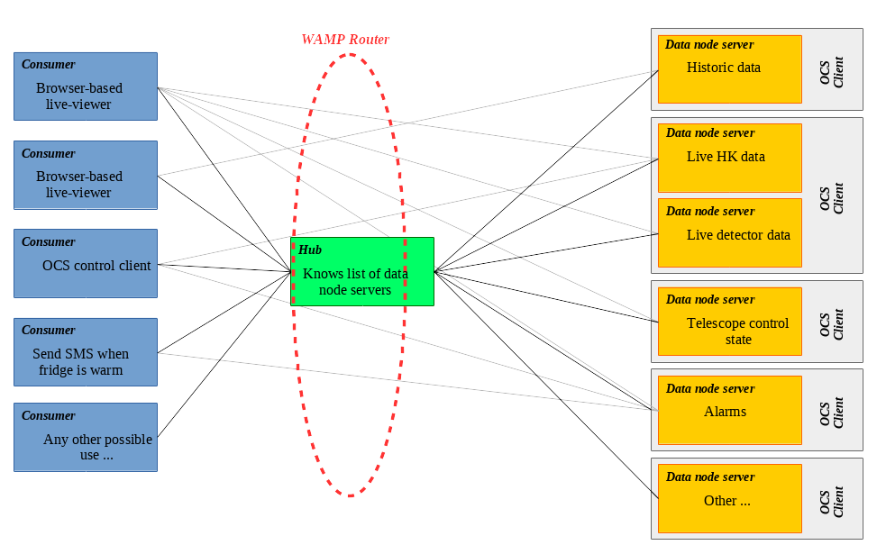

# sisock

## Brief Overview

**Sisock** is a suite of software for serving **Si**mons Observatory data over
web**sock**ets.

The key components are:
- *A WAMP server* &mdash; This runs on just one computer; all data are routed
  through it.
- *Data node servers* &mdash; These can be spread across the internet, located
  on machines from which data are to be served (*data nodes*).
- A *hub* &mdash; The hub keeps track of which data node servers are online.
  Only one hub is run, by default on the computer running the WAMP server).
- *Consumers* &mdash; These are clients that request data from data node
  servers. They connect to the hub in order to know which data node servers are
  available and how to access them.
  - The `components/grafana_server` is an example of a consumer. It reads data
    via `sisock` and then passes it to Grafana over HTTP.

The following diagram illustrates the above:


## Installing and Running

### 1. Setting Up Crossbar

First, we need to set up the crossbar configuration. For this, you need access
to the [ocs-site-configs](https://github.com/simonsobs/ocs-site-configs)
repository.

Everything you need to do to run `sisock` can be done from the `templates` 
directory of this `ocs-site-configs` repo; if you are modifying anything for
local development, you can make a copy of this directory elsewhere.

> **Important**: if you make a copy of these files, for security reasons do
> **not** do it in the root directory of your sisock clone, since it will put 
> the encryption certificates in your docker image. This is not necessarily a 
> problem on your local machine, but would compromise security if the image
> gets pushed to the public DockerHub.

A default configuration can be found in the `templates` directory.
You will need first to run `setup-tls.sh` to generate encryption certificates in
`templates/.crossbar`

> **Important**: the ‘common name’ (CN) of the certificate should be
> `localhost` if you are doing local development, or else the hostname of your
> server if you are in production mode and will be serving over the internet.
> The certificates will be rejected if their CN does not match the real-life
> hostname. You will have to modify the above script if you do not want
> `localhost`. See `templates/.crossbar/README.md` for instructions on manually
> generating the certificates.

The `.crossbar/config.json` file should work out of the box, but advanced users
can tweak settings as they see fit.

### 2. Setting up to use docker

#### Get Dependencies

You will need to have `docker` and `docker-compose` installed on your system.
There are plenty of websites online that give instructions on how to do so, but

```bash
$ pip install docker docker-compose
```

should do the trick.

#### Create `docker-compose.yaml`

We will presume that you want to do local development in the following
instructions.

> If not, instead of using `templates/docker-compose_dev-mode.yaml` from
> `ocs-site-configs`, you could use
> `templates/docker-compose_production-mode.yaml`. In this case, you actually
> don't need any of the `sisock` code locally, since it pulls all the docker 
> images from `grumpy.physics.yale.edu`: see below for how to access images
> from this computer.

Sisock is normally run in `docker` containers using `docker-compose`. You will
need to create a YAML file for configuring this. Again, you can find an example
in the [ocs-site-configs](https://github.com/simonsobs/ocs-site-configs) in
`templates/docker-compose_dev-mode.yaml`.

If you want to use this file ‘out of the box’, define the following environment
variable:
- `SISOCK_DIR` to point to the root of your `sisock` clone.

You can also customise which ports are used for various services, though the
default values are probably fine on most machines.
- `SISOCK_SQL_PORT` (default = 3308; chosen in order not to conflict with 3306
  if you are already running an SQL server).
- `SISOCK_HTTP_PORT` (default = 5000)
- `SISOCK_GRAFANA_PORT` (default = 3000)

Additionally, if you want to use certain data node servers that read data from
your local disc, you should also define:
- For `g3-reader`, define `${SISOCK_HK_DIR}`.
- For `radiometer-server`, define `${SISOCK_RADIOMETER_DIR}`.
- For `apex-weather-server`, define `${SISOCK_APEX_DIR}`.

##### Make Sure You Have Access to the `so3g` Docker Image

The `g3_reader` data node server uses the `so3g` library, whose image is pulled
by `components/g3_file_scanner/Dockerfile`. By default, this image is pulled
from `grumpy` at Yale. You will need to do the following to enable this:

```bash
$ docker login grumpy.physics.yale.edu
```

The username/password is a SO standard: ask Brian Koopman if you don't know it.

Alternatively, you can create your own image locally and alter
`components/g3file_scanner/Dockerfile` as appropriate.

### 3. Go!

#### Firing Things Up

If it doesn't yet exist, create the overarching network for the system:

```bash
$ docker network create --driver bridge sisock-net
```

To run *all* the services, simply do:

```bash
$ docker-compose up
```

> Note that this and all subsequent `docker-compose` commands assume your YAML
> file is named `docker-compose.yaml`. If you are using the out-of-the-box
> configuration from `ocs-site-configs`, use the `-f` flag to specify the
> filename.

Or, you can select which services listed in `docker-compose.yaml` you want to
run. For instance, the following is a nice, minimal check that things are
working:

```bash
$ docker-compose up grafana sisock-http sensors-server
```

> The commands above attach the `stdout` of all the containers to your
> terminal; you can terminate with good ol' ctrl-c. This mode is helpful for
> debugging. However, if you'd like to background this, throw the `-d` flag.

Grafana should now be running: access it at `localhost:3000`. You'll need to 
configure the Grafana data source as the SimpleJson type with a URL of
`http://sisock-http:5000`. (The user defined bridge network, `sisock-net`,
enables DNS resolution by container name, in this case `sisock-http`, as is 
defined in the `docker-compose.yaml` file.)

#### Rebuilding

If you make modifications to the code, `docker-compose up` won't automatically
update the images. You will need to do this yourself with `docker-compose
build`. For instance, if you were working on the code in
`components/data_node_servers/sensors/`, you would do:

```bash
$ docker-compose build sensors-server
```

To rebuild *all* the images (normally not necessary), just do:

```bash
$ docker-compose build
```

#### Clean-up

To shutdown and cleanup, run:

```bash
$ docker-compose down
```

If you'd like to remove the images as well run:

```bash
$ docker-compose down --rmi all
```

This will not remove `sisock-net`. To do so:

```bash
$ docker network rm sisock-net
```

Furthermore, if you really don't want your saved grafana configuration, you can
remove the grafana-storage container:

```bash
$ docker volume rm grafana-storage
```

## License

This project is licensed under the BSD 2-Clause License - see the [LICENSE.txt](LICENSE.txt) file for details.
